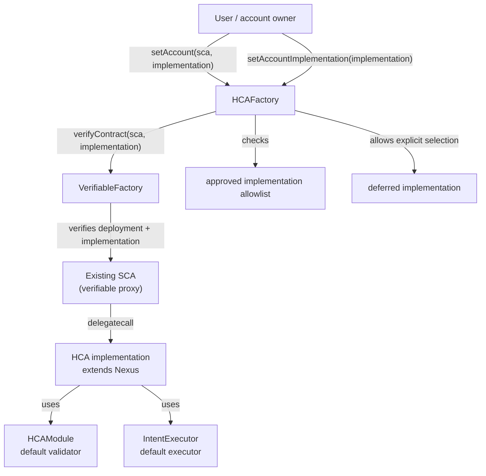

# ENS Hidden Contract Accounts (HCA)

Smart account infrastructure for ENS Hidden Contract Accounts, built on [Nexus](https://github.com/rhinestonewtf/rhinestone-nexus) (ERC-7579 / ERC-4337).

For full documentation, architecture details, and usage instructions, see the [HCA README](https://github.com/rhinestonewtf/ens-modules/blob/hca/README.md).

## Contracts in this directory

### `HCAFactory`

The registry that records user-selected HCA implementations and user-designated HCA proxies:

- Lets a caller designate an already-deployed SCA as their HCA with `setAccount`.
- Lets a caller explicitly pin the HCA implementation they intend to use.
- Records `msg.sender` as the HCA owner for each designation.
- Uses an implementation allowlist for HCA designations.
- Supports a deferred implementation that can be explicitly selected before a concrete HCA upgrade.
- Verifies designated SCAs through the shared `VerifiableFactory`.

### `HCAContext` / `HCAContextUpgradeable`

Context contracts providing HCA factory references and upgrade guards for HCA account implementations.

### `HCAEquivalence`

Equivalence checking utilities for HCA deployments.

## Architecture



## Development

```shell
forge build
forge test
```

## License

GPL-3.0
