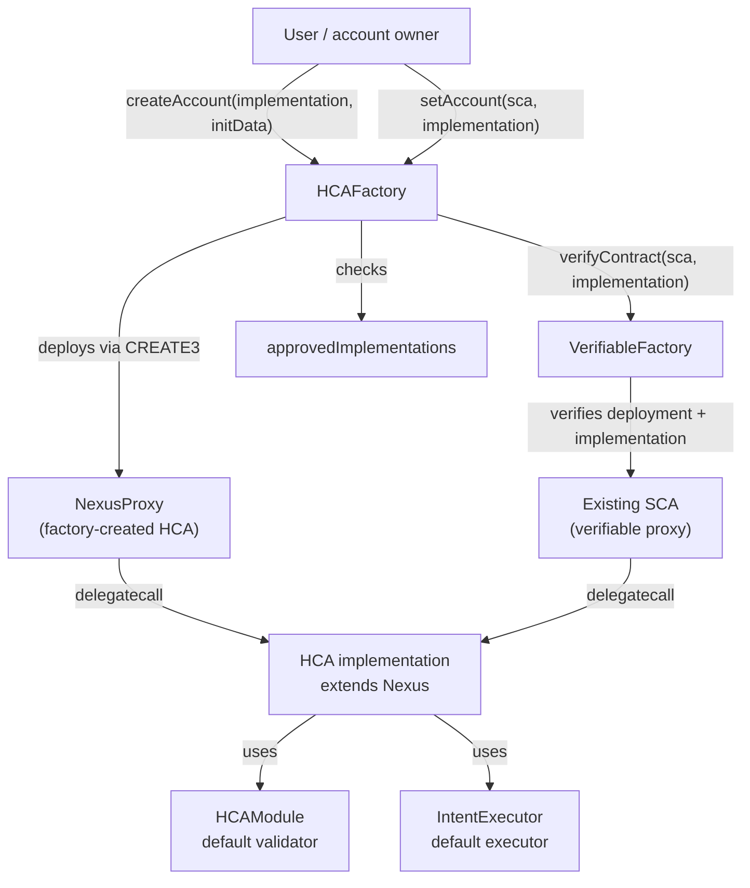

# ENS Hardware-Controlled Accounts (HCA)

Smart account infrastructure for ENS hardware-backed signers, built on [Nexus](https://github.com/rhinestonewtf/rhinestone-nexus) (ERC-7579 / ERC-4337).

For full documentation, architecture details, and usage instructions, see the [HCA README](https://github.com/rhinestonewtf/ens-modules/blob/hca/README.md).

## Contracts in this directory

### `HCAFactory`

The factory that deploys HCA proxies:

- Deploys `NexusProxy` instances via CREATE3, deriving deterministic addresses from the caller.
- Lets a caller designate an already-deployed SCA as their HCA with `setAccount`.
- Requires the caller to be the recorded HCA owner; ownership is no longer extracted from init data.
- Uses an implementation allowlist for HCA deployments and verifiable HCA designations.
- Verifies designated SCAs through the shared `VerifiableFactory`.
- `createAccount` is idempotent for the caller — calling it again forwards ETH to the existing account.

### `HCAContext` / `HCAContextUpgradeable`

Context contracts providing HCA factory references and upgrade guards for HCA account implementations.

### `HCAEquivalence`

Equivalence checking utilities for HCA deployments.

### `ProxyLib`

Library for HCA proxy deployment operations.

## Architecture



## Development

```shell
forge build
forge test
```

## License

GPL-3.0
