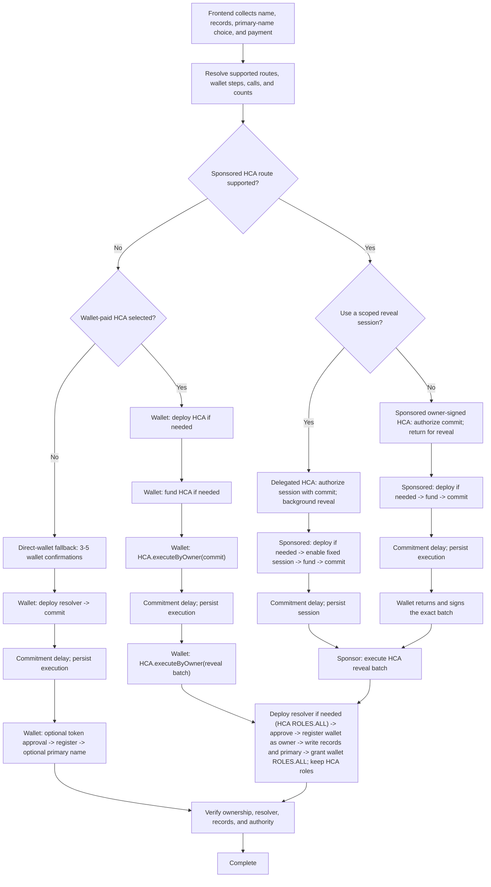

# HCA frontend handoff

## Goal

Let a user register with stablecoins without registration-chain gas. The wallet owns the name and receives `ROLES.ALL` on its resolver. The HCA executes the flow and keeps resolver roles for later actions.

## Current frontend

Manager currently uses `@ens-apps/transaction-manager` and its `registrationMachine`. It does not yet support standalone-HCA routes, local deployments, or reload recovery. Manager's Rhinestone signer uses the legacy HCA.

## Responsibility boundaries

| Area | Responsibility |
|---|---|
| Manager feature and UI | Inputs, route display, wallet prompts, progress, recovery, and result checks |
| Shared app integration | Supported routes, ENS calls, interaction counts, execution, and resume data |
| Rhinestone SDK and orchestrator | Standalone adapter, signing, sponsored routing, funding, and relay |

Feature UI consumes the shared app integration rather than building HCA calls or calling mockestrator.

## Routes

### Wallet-paid HCA

Wallet-paid HCA routes through the user's wallet instead of Rhinestone. The wallet pays gas and sends `HCA.executeByOwner(calls)`. There is no separate HCA signature.

Manager considers it after sponsored routes and chooses the lower-interaction wallet route. On a tie, use it only when the HCA must be the caller. Explorer shows every supported route and its interaction count.

The wallet needs native gas. The HCA needs any payment tokens used by the batch. Count deployment and funding separately unless the wallet or funding route combines them.

### Defaults

| Flow | Manager | Explorer |
|---|---|---|
| Registration | Delegated HCA, sponsored owner-signed HCA, then the lower-interaction of wallet-paid HCA or direct wallet | Offer supported routes with counts |
| Stablecoin renewal | Sponsored HCA, then the lower-interaction of wallet-paid HCA or direct wallet | Offer supported routes with counts |
| Resolver records | Existing sponsored session, else direct wallet | Sponsored session, wallet-paid HCA, or direct wallet |
| Primary name during registration | Registration batch | Registration batch |
| Primary name later | Sponsored session, sponsored owner-signed HCA, then direct wallet | Sponsored session, sponsored owner-signed HCA, or direct wallet |
| Registry operator approval | Do not request at launch | Direct wallet: `setApprovalForAll(HCA, true/false)` |
| Resolver or registry-role changes | Direct wallet | Direct wallet or wallet-paid HCA with the required authority |
| Subnames | Not supported at launch | Direct wallet or wallet-paid approved HCA |
| Transfer | Direct wallet | Direct wallet; wallet-paid approved HCA only by explicit choice |

### Registry approval

- `setApprovalForAll(HCA, true)` is persistent and registry-wide. It gives the HCA inherited non-root roles and registry-token operator authority.
- Manager should use it only for expected repeated registry actions, not one-off changes.
- Explorer should expose enable and revoke actions, explain the scope, and leave the choice to the user.
- No sponsored registry route is currently available. Wallet-paid HCA can use an existing approval.

### Later primary-name changes

1. If an unexpired session and a sponsor are available, sponsor `DefaultReverseRegistrarAdapter.setNameWithHCA(owner, name)` with no new wallet prompt.
2. Otherwise, if a sponsoring relayer is available, request one owner signature and submit the same HCA call.
3. Otherwise use one direct-wallet transaction to `DefaultReverseRegistrarAdapter.setName(owner, name)`.

## Registration

### Flow

Diagram counts start after wallet connection and omit a conditional network switch.

The map shows Manager's default order. Explorer may start from any route it displays.



### HCA deployment and commitment

On a given chain, the HCA address is fixed by the factory, deployer, owner, initial implementation, and user salt:

```text
deploymentSalt = keccak256(abi.encode(userSalt, owner, initialImplementation))
HCA = VerifiableFactory proxy address for (StandaloneHCADeployer, deploymentSalt)
```

If the HCA has no code, the sponsored route includes this setup operation:

```text
StandaloneHCADeployer.deploy(
  owner,
  initialImplementation,
  userSalt
)
```

The same sponsored transaction calls `ETHRegistrar.commit(commitment)`. Existing HCAs omit setup.

For delegated registration, that transaction also has the HCA call:

```text
OwnerBoundRegistrationSessionValidator.enableSession(
  permissionId,
  sessionKey,
  validUntil,
  resolver
)
```

The shared integration creates or loads the session key, derives `permissionId` with Rhinestone's existing session format, and keeps the session available across the commitment delay. The later reveal uses it without another wallet prompt.

Before submission and on retry, refresh the HCA state. If it now exists, verify its deployment, owner, and supported implementation, then omit setup.

For wallet-paid execution, the wallet calls `StandaloneHCADeployer.deploy(...)` if needed, then sends one transaction to:

```text
HCA.executeByOwner([{ target: ETHRegistrar, value: 0, callData: commit(commitment) }])
```

### Registration batch

After the delay, Rhinestone submits the sponsored batch, or the wallet passes the same calls to `HCA.executeByOwner(...)`:

1. If the HCA's resolver does not exist, `VerifiableFactory.deployProxy(...)` with `PermissionedResolver.initialize(HCA, ROLES.ALL, [])`.
2. `paymentToken.approve(ETHRegistrar, registrationPrice)`.
3. `ETHRegistrar.register(label, owner, secret, subregistry, resolver, duration, paymentToken, referrer)`.
4. Requested resolver writes: `setAddr(...)`, `setText(...)`, or `multicall(...)`.
5. Optional primary setup: `PermissionedResolver.setName(...)` and `DefaultReverseRegistrarAdapter.setNameWithHCA(owner, name)`.
6. `PermissionedResolver.authorizeNameRoles(0x00, ROLES.ALL, owner, true)`.

`owner` is the wallet. The wallet becomes resolver co-admin; the HCA keeps its resolver roles. Later registrations through the same HCA reuse its verified resolver and omit step 1. All included calls share one registration-chain transaction.

The batch is atomic. Frontend must show every inner call before requesting the transaction.

### Expected wallet interactions

A wallet interaction is a connection, network switch, signature, or transaction confirmation. These are target shapes, not current integration evidence. The tables exclude wallet connection and a conditional switch; resolved route totals include a switch when required.

#### Sponsored HCA

| Funding state | Delegated HCA prompts | Sponsored owner prompts | Wallet transactions | Destination transactions |
|---|---:|---:|---:|---:|
| Allowance ready | 1: commit/session authorization | 2: commit and reveal authorizations | 0 | 2 target |
| Supported gasless permit needed | 2: permit and commit/session authorization | 3: permit, commit, and reveal authorizations | 0 | 2 target |
| Onchain approval on source chain | 2: approval transaction and commit/session authorization | 3: approval transaction, commit authorization, reveal authorization | 1 source | 2 target |
| Onchain approval on registration chain | 2: approval transaction and commit/session authorization | 3: approval transaction, commit authorization, reveal authorization | 1 destination | 3 target |

Show the counts returned by Rhinestone. Do not offer a sponsored route unless funding and sponsored submission are available.

Account deployment does not add a destination transaction when Rhinestone includes it in the first sponsored transaction.

#### Wallet-paid HCA

| State | Extra HCA prompts | Wallet transactions | Wallet interactions |
|---|---:|---:|---:|
| HCA deployed and funded | 0 | 2: commit and reveal | 2 |
| HCA deployment needed | 0 | +1 | +1 |
| Wallet token transfer needed | 0 | +1 | +1 |

Cross-chain or Permit2 funding may add signatures. A batch-capable wallet or funding route may combine extra steps. Compare the complete interaction totals, not a fixed route preference.

#### Direct wallet

| Setup | Prompts | Wallet transactions |
|---|---:|---:|
| Allowance ready; no primary | 3 | 3 |
| Approval needed; no primary | 4 | 4 |
| Allowance ready; primary | 4 | 4 |
| Approval needed; primary | 5 | 5 |

Wallet calls:

1. `VerifiableFactory.deployProxy(PermissionedResolver implementation, resolverSalt, PermissionedResolver.initialize(owner, ROLES.ALL, setters))`, where `setters` contains the requested resolver writes and optional `PermissionedResolver.setName(...)`.
2. `ETHRegistrar.commit(commitment)`.
3. Optional `paymentToken.approve(ETHRegistrar, registrationPrice)`.
4. `ETHRegistrar.register(label, owner, secret, subregistry, resolver, duration, paymentToken, referrer)`.
5. Optional `DefaultReverseRegistrarAdapter.setName(owner, name)`.

A smart-wallet batch or reused resolver may reduce the count. Calculate it from current state before the first prompt.

## Frontend requirements

1. Accept owner, name, duration, records, primary-name choice, source chain, and payment token.
2. Load local deployments from configuration.
3. Resolve supported routes from current allowance, HCA, resolver, gas, funding, and wallet capabilities.
4. Before the first prompt, show payment, wallet actions, submitters, important inner calls, interaction counts, gas requirements, and whether the user must return.
5. Resume after the commitment delay or reload using the current wallet connection.
6. Refresh mutable state before submission and recover when the expected HCA already exists.
7. Show: authorizing, funding, committed, revealing, verifying, complete, action required, or failed.
8. Verify name ownership, resolver, records, primary name, wallet `ROLES.ALL`, and retained HCA roles.

If route preparation fails, show a supported wallet fallback or a specific blocker. Never silently change route, payment, prompt count, or background behavior.

## Devnet

```sh
docker compose --profile default up -d --build mockestrator
```

This starts `devnet` and `mockestrator`.

| URL | Service |
|---|---|
| `http://127.0.0.1:8545` | Devnet RPC |
| `http://127.0.0.1:8000/deployments` | Local addresses |
| `http://127.0.0.1:3007` | Mock route and fill service |

Mockestrator only mocks Rhinestone route and fill responses. Wallet-paid HCA uses the devnet RPC and ENS deployments directly. Feature code must not call port 3007.

For sponsored devnet testing:

1. Start the stack.
2. Configure:

   ```env
   VITE_RHINESTONE_ENDPOINT_URL=/orchestrator
   VITE_RHINESTONE_CUSTOM_RPC_URLS={"31337":"http://127.0.0.1:8545"}
   ```

3. Configure chain 31337 with addresses from `GET http://127.0.0.1:8000/deployments`. Local address configuration and the standalone Rhinestone adapter are not implemented yet.

## Acceptance

Frontend sign-off requires E2E coverage of each wallet-step shape, reload during the delay, the selected resolver, requested records and primary name, wallet ownership, wallet `ROLES.ALL`, and retained HCA roles.
