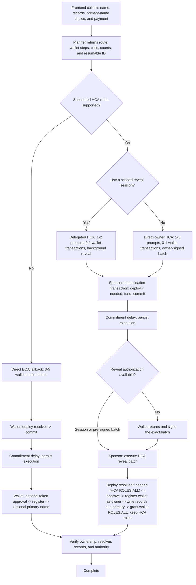

# HCA frontend handoff

## Goal

Let a user register with stablecoins without registration-chain gas. The wallet owns the name and receives `ROLES.ALL` on its resolver. The HCA executes the flow and keeps resolver roles for later sponsored actions.

## Frontend boundary

Frontend:

- collects the name, duration, records, primary-name choice, and payment;
- requests a prepared plan from the shared transaction layer;
- shows every signature, transaction, network switch, wait, and recovery step;
- persists the execution across the commitment delay; and
- verifies ownership, resolver, records, primary name, wallet authority, and retained HCA roles.

Frontend does not derive HCAs, inspect allowances, build routes, encode calls, define permissions, or call mockestrator.

## Route policy

| Flow | Manager | Explorer |
|---|---|---|
| Registration | Delegated HCA, then direct-owner HCA, then wallet | Delegated HCA, direct-owner HCA, or wallet |
| Stablecoin renewal | Sponsored HCA, else wallet | Sponsored HCA or wallet |
| Resolver records | Existing sponsored session, else wallet | Sponsored session or wallet |
| Primary name during registration | Registration batch | Registration batch |
| Primary name later | Sponsored session, then sponsored direct-owner HCA, then wallet | Sponsored session, direct-owner HCA, or wallet |
| Registry operator approval | Do not request at launch | Offer `setApprovalForAll(HCA, true/false)` |
| Resolver or registry-role changes | Wallet | Wallet or approved HCA |
| Subnames | Not supported at launch | Wallet or approved HCA |
| Transfer | Wallet | Wallet; approved HCA only by explicit choice |

An approved HCA still needs action-specific authorization and sponsorship.

### Registry approval

- `setApprovalForAll(HCA, true)` is persistent and registry-wide. It gives the HCA inherited non-root roles and registry-token operator authority.
- Manager should use it only for expected repeated registry actions, not one-off changes.
- Explorer should expose enable and revoke actions, explain the scope, and leave the choice to the user.
- The current registration validator does not authorize registry calls.

### Later primary-name changes

The validator allows standalone `setNameWithHCA` when the policy has a resolver and the named account is the HCA owner.

1. Reuse an unexpired session and sponsor with no new wallet prompt.
2. Otherwise use a sponsored direct-owner HCA action with one wallet signature.
3. Otherwise use one wallet transaction.

`DefaultReverseRegistrarAdapter` has no generic signature-relay method. Every HCA route still needs a sponsor.

## Registration map

Counts start after wallet connection and exclude a conditional network switch.



## Exact registration calls

### HCA deployment and commitment

On a given chain, the HCA address is fixed by the factory, deployer, owner, initial implementation, and user salt:

```text
deploymentSalt = keccak256(abi.encode(userSalt, owner, initialImplementation))
HCA = VerifiableFactory proxy address for (StandaloneHCADeployer, deploymentSalt)
```

If the HCA has no code, the prepared intent includes this account setup operation:

```text
StandaloneHCADeployer.deploy(
  owner,
  initialImplementation,
  userSalt
)
```

The same intent includes `ETHRegistrar.commit(commitment)` as its destination call. Account setup and commitment execute in one sponsored destination transaction. Existing HCAs omit setup.

Plans are state snapshots. If the first sponsored submission fails, request a fresh plan. When the expected HCA now exists, the planner verifies its factory deployment, owner, and current implementation under the supported account-version policy, then returns a retry without setup.

The current repo E2E bypasses the Rhinestone adapter, so it calls deployment and commitment separately and mints test tokens to the HCA. Frontend uses the plan's targets and calldata and does not encode deployment itself.

### HCA registration batch

After the delay, the sponsor submits one HCA batch:

1. If the HCA's resolver does not exist, `VerifiableFactory.deployProxy(...)` with `PermissionedResolver.initialize(HCA, ROLES.ALL, [])`.
2. `paymentToken.approve(ETHRegistrar, registrationPrice)`.
3. `ETHRegistrar.register(label, owner, secret, subregistry, resolver, duration, paymentToken, referrer)`.
4. Requested resolver writes: `setAddr(...)`, `setText(...)`, or `multicall(...)`.
5. Optional primary setup: `PermissionedResolver.setName(...)` and `DefaultReverseRegistrarAdapter.setNameWithHCA(owner, name)`.
6. `PermissionedResolver.authorizeNameRoles(0x00, ROLES.ALL, owner, true)`.

`owner` is the wallet. The wallet becomes resolver co-admin; the HCA keeps its resolver roles. Later registrations through the same HCA reuse its verified resolver and omit step 1. All included calls share one registration-chain transaction.

## Wallet interactions

A wallet interaction is a connection, network switch, signature, or transaction confirmation. The tables exclude connection and a conditional network switch.

| Funding state | Delegated HCA prompts | Direct-owner HCA prompts | Wallet transactions | Destination transactions |
|---|---:|---:|---:|---:|
| Allowance ready | 1: funding/session signature | 2: funding and reveal signatures | 0 | 2 target |
| Supported gasless permit needed | 2: permit and funding/session signatures | 3: permit, funding, and reveal signatures | 0 | 2 target |
| Onchain approval on source chain | 2: approval transaction and funding/session signature | 3: approval transaction, funding signature, reveal signature | 1 source | 2 target |
| Onchain approval on registration chain | 2: approval transaction and funding/session signature | 3: approval transaction, funding signature, reveal signature | 1 destination | 3 target |

Direct-owner authorization adds one signature, not an HCA transaction. Source and settlement counts come from the plan. Do not offer an HCA route unless funding and sponsored submission are available.

Account deployment does not add a destination transaction when Rhinestone includes it as the first intent's setup operation.

The contracts cover direct-owner authorization. Manager's shared packages do not yet expose the standalone-HCA path.

### Direct-wallet fallback

| Setup | Prompts | Wallet transactions |
|---|---:|---:|
| Allowance ready; no primary | 3 | 3 |
| Approval needed; no primary | 4 | 4 |
| Allowance ready; primary | 4 | 4 |
| Approval needed; primary | 5 | 5 |

Wallet calls:

1. `VerifiableFactory.deployProxy(PermissionedResolver implementation, resolverSalt, PermissionedResolver.initialize(owner, ROLES.ALL, setters))`, where `setters` contains the requested resolver writes and optional `PermissionedResolver.setName(...)`.
2. `ETHRegistrar.commit(commitment)`.
3. Optional `paymentToken.approve(ETHRegistrar, registrationPrice)`.
4. `ETHRegistrar.register(label, owner, secret, subregistry, resolver, duration, paymentToken, referrer)`.
5. Optional `DefaultReverseRegistrarAdapter.setName(owner, name)`.

A smart-wallet batch or reused resolver may reduce the count. Use the plan's count.

## Frontend implementation

Use one plan-driven state machine.

1. Send owner, name, duration, records, primary-name choice, source chain, and payment token.
2. Require ordered wallet steps, chain and submitter per transaction, target and important inner calls, total interactions, per-chain counts, background-reveal support, and a resumable execution ID.
3. Before the first prompt, show payment, source chain and token, signatures, wallet transactions, gas requirements, and whether the user must return.
4. Persist the execution ID, execute only returned steps, and resume after reload.
5. Show: authorizing, funding, committed, revealing, verifying, complete, action required, or failed.
6. Verify the wallet owns the name, the registry points to the planned resolver, records and optional primary name are correct, the wallet has `ROLES.ALL`, and the HCA retains its intended roles.

If planning fails, show a supported wallet fallback or a specific blocker. Never silently change route, payment, prompt count, or background behavior.

## Mockestrator devnet

```sh
docker compose --profile default up -d --build mockestrator
```

This starts `devnet` and `mockestrator`.

| URL | Service |
|---|---|
| `http://127.0.0.1:8545` | Devnet RPC |
| `http://127.0.0.1:8000/deployments` | Local addresses |
| `http://127.0.0.1:3007` | Mock route and fill service |

Mockestrator tests transport only. It does not prepare, authorize, or secure the standalone HCA.

Manager still needs a standalone-HCA adapter, the plan/execution path above, and injectable chain and ENS addresses. Feature code must not call port 3007.

When those interfaces exist:

1. Start the stack.
2. Configure:

   ```env
   VITE_RHINESTONE_ENDPOINT_URL=/orchestrator
   VITE_RHINESTONE_CUSTOM_RPC_URLS={"31337":"http://127.0.0.1:8545"}
   ```

3. Select chain 31337 and pass `GET http://127.0.0.1:8000/deployments` to the shared packages.
4. Run the normal frontend state machine.

Frontend sign-off requires E2E coverage of each wallet-step shape, reload during the delay, the planned resolver, requested records and primary name, wallet ownership, wallet `ROLES.ALL`, and retained HCA roles.
