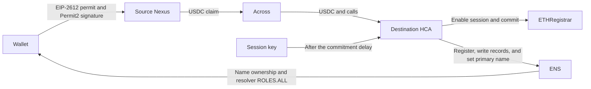

# HCA

The HCA is an optional ENS execution account owned by one wallet. It provides three main benefits:

- It submits registration and other supported ENS transactions when the wallet cannot or should not transact on the registration chain.
- Its execution fees can be paid in supported stablecoins instead of requiring the wallet to hold native gas on that chain.
- A temporary, revocable session can keep registration, record updates, and primary-name changes inside the application without asking the wallet to authorize every operation.

It is not the user's identity, a name owner, or a general wallet. ENS contracts do not treat it as equivalent to its owner. Names are registered directly to the wallet, which receives resolver `ROLES.ALL`. The HCA keeps resolver roles so later authorized edits can be submitted through it; the wallet can revoke those roles and the HCA's sessions.

The session removes repeated wallet prompts; the selected Rhinestone route determines whether execution is sponsored or paid in stablecoins. A capable smart account or direct wallet path may still be simpler, and the application should not silently force the HCA.

## Registration

The supported cross-chain flow uses a counterfactual Nexus owned by the user on the source chain and the HCA on the registration chain. It does not use a shared account or an EOA as the source account.

The Nexus makes the user's source-chain funds and Permit2 authorization executable. The HCA remains the destination caller because its ENS permissions and session policy apply there.



For a fresh permit-capable USDC wallet:

1. The application derives the source Nexus and destination HCA from the same ECDSA owner.
2. The wallet signs an EIP-2612 permit allowing the source Nexus to pull the disclosed USDC budget.
3. The wallet signs one Permit2 intent. That signature authorizes the source claim and is also used as the destination HCA owner signature; the SDK must not request another destination signature.
4. The source transaction deploys the Nexus if needed, executes the permit, pulls the budget from the wallet, and lets the Nexus approve and use Permit2.
5. Across fills the requested destination amount to the HCA. The fill deploys the HCA if needed, enables a session with execution-fee limits, and commits.
6. After the commitment delay, the session key submits the registration batch without another wallet prompt.

This is two wallet interactions, both signatures, with no wallet transaction or native gas. Wallet connection and a required network switch are separate interactions. A token without permit support needs an onchain approval to the source Nexus and source-chain gas.

The permit itself moves no funds. The disclosed source budget is pulled when the source transaction executes. Permit2 spends the amount required by the prepared route; any remainder stays in the user's Nexus and must be shown, reused, or withdrawn. There is no protocol-defined buffer: the application chooses the source budget from the destination requirement and Rhinestone's quoted fees, then shows it before signing.

The destination HCA is funded during the fill because it pays the registrar and, on the user-paid path, the later session execution fees. It should not retain funds that are no longer needed.

On the registration chain, a fresh same-chain flow can also use two signatures: an EIP-2612 funding permit and one owner authorization that deploys the HCA if needed, funds it, enables the session, and commits. The session reveals after the delay. Existing funding or an existing valid session can reduce the prompts.

The reveal is one atomic HCA batch:

1. Deploy the approved `PermissionedResolver` through `VerifiableFactory` if the HCA's resolver does not exist, initialized with HCA `ROLES.ALL`.
2. Approve `ETHRegistrar` for the registration price.
3. Call `ETHRegistrar.register(...)` with the wallet as owner.
4. Write the requested resolver records.
5. If requested, call `PermissionedResolver.setName(...)` and `DefaultReverseRegistrarAdapter.setNameWithHCA(...)` for the wallet's primary name.
6. Grant the wallet resolver `ROLES.ALL`. Do not revoke the HCA's resolver roles.

Later registrations may reuse the verified HCA and resolver. Each name still requires its own commitment.

## Account and permissions

The account is a Nexus implementation with a fixed validator and executor. The current implementation disables module installation and removal, but an approved implementation upgrade may change the fixed modules. The account rejects the standard ERC-721 and ERC-1155 receiver callbacks. It may temporarily hold ETH or supported tokens, but it is not intended to keep a balance.

| Contract | Purpose |
|---|---|
| `StandaloneSingleOwnerHCA` | Stores one owner, executes owner and session calls, revokes sessions, and controls upgrades. |
| `StandaloneHCAFactory` | Deploys an owner-bound HCA through the shared `VerifiableFactory`. |
| `HCAOwnerAndSessionValidator` | Verifies owner signatures, ERC-4337 UserOperations, and the fixed ENS session policy. |
| `ApprovedUpgradeGate` | Records DAO-approved implementation transitions. |

The HCA address is deterministic:

```text
deploymentSalt = keccak256(abi.encode(userSalt, owner, initialImplementation))
HCA = VerifiableFactory proxy address for (StandaloneHCAFactory, deploymentSalt)
```

Anyone may submit `StandaloneHCAFactory.deploy(owner, implementation, userSalt)`, but they cannot change the owner or implementation at the expected address. If the HCA already exists, the application verifies its address, owner, and implementation and reuses it. A mismatched deployment is an error, not a reason to select another account silently.

An owner transaction may call `HCA.executeByOwner(calls)` for an atomic wallet-paid batch. The transaction authenticates the owner, so it needs no additional HCA signature and is not restricted by the session policy. Wallet-paid registration needs one such transaction for commit and another for reveal, plus deployment or funding transactions when required. This is also the direct recovery path for HCA-held funds.

A session stores a session key, expiry, resolver, and the HCA's current session nonce. A user-paid session also limits the refund token, exchange rate, gas overhead, and token amount. `revokeSessions()` increments the nonce and invalidates every existing session. It currently requires a direct owner transaction on the registration chain, including native gas; it cannot be submitted through an HCA execution path.

Only the configured `IntentExecutor` may present session operations. The signed data binds the chain, executor, HCA, nonce, exact calls, and any execution refund. The current validator permits commitments, registration, deployment of the configured resolver implementation, resolver writes, primary-name changes, supported-token approvals, and the registration-time wallet role grant.

Before release, that policy still needs to be narrowed and fully checked:

- Resolver deployment must bind the expected salt, address, initializer, initial roles, seeded records, and the resolver passed to `register`.
- The wallet role grant must require the root resource, `ROLES.ALL`, the wallet as recipient, `grant == true`, and the expected position in the registration batch.
- Registrar and execution-fee approvals must be limited to the required spender and amount.

The session key may choose registration labels, primary names, and record values within the account's resolver. Registration still fixes the owner to the wallet and the resolver to the session's resolver. The policy excludes renewal, resolver replacement, direct authority grants to another account, registry approval, transfers, subnames, module or upgrade management, arbitrary token movement, and arbitrary targets.

Renewal does not require name authority. Any payer may renew directly, or the application may obtain fresh owner authorization for an HCA route without giving the ongoing session renewal permission.

The session is intended to cover registration, ordinary resolver records, and primary-name changes within the account's resolver until expiry or revocation, rather than one pre-signed registration. High-risk custody and authority changes remain owner-authorized.

A later primary-name change may use a valid session and `DefaultReverseRegistrarAdapter.setNameWithHCA(...)` without another wallet prompt. Without a usable session, it requires an owner-authorized HCA or direct-wallet operation.

The HCA keeps resolver roles after registration. The wallet may later revoke them. `Registry.setApprovalForAll(HCA, true)` is separate, persistent, and registry-wide; it gives registry-token operator authority and inherited non-root roles. It is not needed for registration and should not be requested by Manager at launch. Explorer may expose explicit enable and revoke actions when the user expects repeated registry operations. Transfers remain direct-wallet operations by default, and Manager does not support HCA subname creation at launch.

Upgrades require three independent conditions: the HCA owner initiates the upgrade, the current implementation's target gate approves the new implementation, and the new implementation's predecessor gate approves the current implementation. The DAO controls the gates. The initial implementation has no predecessor gate, so existing accounts cannot upgrade into it.

## Integration

Rhinestone's existing Permit2, Across, `SingleChainOps`, Smart Session, and owner-signature formats are reused. The orchestrator does not need a new route or signature type. The SDK needs to recognise the standalone account and supply its deployment and fixed-validator configuration:

```text
type = hca
version = ens-standalone-1.1.0
factory
implementation
validator
verifiableFactory
proxyLogic
userSalt
```

From that configuration, the SDK derives the address, returns `StandaloneHCAFactory.deploy(...)` as setup or ERC-4337 factory data, selects the fixed validator for owner and session signatures, and adapts the existing Smart Session signature to the validator call. Fresh accounts include setup; verified existing accounts omit it.

For cross-chain registration, the source account must be the user's Nexus. An EOA source does not execute the destination calls through the HCA. Submit the user-paid flow with `sponsored: false` and USDC as `feeAsset`. The session signs Rhinestone's existing refund fields, and the validator limits payment to the configured refund paymaster and session caps.

ERC-4337 owner execution is also implemented. A fresh HCA can deploy and execute in one UserOperation, and a paymaster may pay its gas. This passes locally but is not part of the proven production route and has not been tested with a production paymaster.

The application integration should:

1. Collect the name, duration, records, primary-name choice, source chain, and payment token.
2. Derive and verify the source Nexus, HCA, implementation, resolver, allowance, balances, session, and current registration price.
3. Prepare the route before prompting and show the source budget, destination amount, fees, wallet interactions, submitters, all inner calls, and whether the user must return.
4. Never change the calls, payment, interaction count, submitter, or background behavior silently after authorization.
5. Choose and disclose the session expiry, store the session key securely, and persist the commitment, account version, resolver, and route state so registration can resume after the delay or a reload.
6. Refresh mutable state before submission. If another caller deployed the expected HCA, verify and reuse it.
7. Verify the final owner, resolver, records, primary name, wallet `ROLES.ALL`, and retained HCA roles.
8. Expose recovery for unused Nexus funds, unnecessary HCA funds, failed fills, expired sessions, changed prices, and failed reveals.

Manager should prefer the supported path requiring the fewest wallet interactions. Explorer may show other supported owner and direct-wallet paths with their actual interaction counts. Wallet-paid HCA execution means sending `executeByOwner` through the user's wallet instead of Rhinestone.

## Local development

Start the devnet and mockestrator from the repository root:

```sh
docker compose --profile default up -d --build mockestrator
```

| URL | Service |
|---|---|
| `http://127.0.0.1:8545` | Devnet RPC |
| `http://127.0.0.1:8000/deployments` | Local deployment addresses |
| `http://127.0.0.1:3007` | Mock Rhinestone route and fill service |

Frontend configuration:

```env
VITE_RHINESTONE_ENDPOINT_URL=/orchestrator
VITE_RHINESTONE_CUSTOM_RPC_URLS={"31337":"http://127.0.0.1:8545"}
```

Mockestrator supplies local route and fill responses. It is not the HCA adapter, a bundler, a paymaster, or evidence of the production authorization path. Feature code should use the normal Rhinestone integration rather than call port 3007 directly. Manager still needs standalone-HCA and chain-31337 integration before this stack provides an end-to-end Manager flow.

## Status

The patched SDK has completed fresh and existing same-chain registrations on Sepolia. A fresh zero-ETH wallet also completed the Arbitrum Sepolia-to-Sepolia Nexus flow with two signatures, no wallet transactions, USDC-paid execution, two registrations, primary-name setup, wallet ownership, wallet `ROLES.ALL`, and retained HCA roles. Fresh ERC-4337 deployment and paymaster execution pass locally.

The live Nexus proof is:

```sh
cd contracts
bun run check:hca-live:permit-pull
```

This is a state-changing test. It requires Sepolia and Arbitrum Sepolia RPCs, `DEPLOYER_KEY`, `CIRCLE_API_KEY`, and `RHINESTONE_API_KEY`. It creates a fresh owner and requests Circle faucet USDC; fallback funding from the operator is disabled unless `HCA_ALLOW_SOURCE_TEST_TOP_UP=1`.

The implementation is not release-ready. Remaining work includes the validator argument checks above, executor audit and operational controls, owner recovery and revocation evidence, upgrade evidence, publication of the SDK adapter, Manager integration and reload recovery, an account-version and user-salt policy, a supported chain and token matrix, frontend E2E, and production gas measurements. A production bundler and paymaster are required only if the ERC-4337 route is offered.
