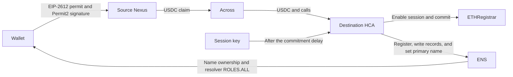

# HCA

## Purpose

An HCA is an optional ENS execution account. One wallet owns the HCA.

The HCA can:

- Execute atomic batches for registration and supported ENS updates
- Submit commitments and register names for the wallet
- Deploy or use the wallet's resolver
- Change resolver records and the wallet's primary name
- Keep resolver authority for later authorized updates
- Use one session for multiple registrations and updates until expiry or revocation
- Hold supported tokens during an operation
- Pay registration and execution costs
- Execute owner-authorized renewals and fund recovery

With explicit wallet approval, the HCA can perform supported registry operations. Manager does not request this approval at launch.

A Rhinestone route can:

- Deploy and fund the HCA during its first operation
- Sponsor execution fees or charge them in a supported stablecoin
- Move authorized funds from another chain through the user's Nexus, Permit2, and Across

Sessions and sponsorship are separate. A session removes wallet prompts. Sponsorship changes who pays execution fees.

The HCA is not the user's identity or a general wallet. ENS does not treat the HCA as the wallet. The HCA receives authority from owner authorization, sessions, resolver roles, and optional registry approval.

The HCA does not own the registered names. The registrar assigns each name to the wallet. The wallet receives resolver `ROLES.ALL` during registration.

The HCA keeps its resolver roles after registration. These roles let an authorized session change records and the primary name. The wallet can revoke the resolver roles and the HCA sessions. The application must not select an HCA without user approval. A direct wallet or capable smart account can use a simpler route.

## System parts

The registration system uses an HCA on the registration chain. A cross-chain route also uses the user's Nexus on the source chain. The source Nexus pulls only the authorized source-chain funds. The destination HCA makes the ENS calls.

| Contract | Function |
|---|---|
| `StandaloneSingleOwnerHCA` | Stores one owner, executes calls, revokes sessions, and controls upgrades. |
| `StandaloneHCAFactory` | Deploys an HCA through the shared `VerifiableFactory`. |
| `HCAOwnerAndSessionValidator` | Validates owner signatures, UserOperations, and the ENS session policy. |
| `ApprovedUpgradeGate` | Stores the implementation upgrades that the DAO permits. |

The HCA uses a Nexus implementation with a fixed validator and executor. The implementation prevents module installation and removal. An approved upgrade can change the fixed modules. The HCA rejects the standard ERC-721 and ERC-1155 receiver callbacks. The HCA can hold ETH or supported tokens for a short time. It is not an account for long-term funds.

### HCA address

The factory calculates the HCA address from the owner, implementation, and user salt:

```text
deploymentSalt = keccak256(abi.encode(userSalt, owner, initialImplementation))
HCA = VerifiableFactory proxy address for (StandaloneHCAFactory, deploymentSalt)
```

A person can call `StandaloneHCAFactory.deploy(owner, implementation, userSalt)`. The caller cannot change the expected owner, implementation, or address. If there is an HCA at this address, the application must validate its owner and implementation. The application can then use the HCA. If these values are incorrect, the application must show an error. It must not select a different account without user approval.

## Registration routes

Each registration has a commitment and a registration. The registration occurs after the commitment delay.

### Cross-chain registration

The cross-chain route uses the user's counterfactual Nexus on the source chain. It uses the HCA on the registration chain. A counterfactual account has a known address before its deployment. The route does not use a shared account or a source EOA.



For a new wallet with USDC that supports EIP-2612, the route has these steps:

1. The application derives the source Nexus and the destination HCA from the same ECDSA owner.
2. The wallet signs an EIP-2612 permit. This permit lets the source Nexus pull the shown USDC budget.
3. The wallet signs one Permit2 intent. This signature authorizes the source claim and the destination HCA.
4. The SDK uses the Permit2 signature as the HCA owner signature. It must not request a second HCA signature.
5. The source transaction deploys the Nexus when necessary. It executes the permit and pulls the budget from the wallet.
6. The Nexus approves Permit2. Permit2 then transfers the amount in the route.
7. Across sends the destination funds and calls to the HCA. The fill deploys the HCA when necessary.
8. The HCA enables the session and submits the commitment.
9. After the delay, the session key submits the registration batch.

This route has two wallet interactions. The two interactions are signatures. The wallet does not send a transaction. No native gas is necessary for the wallet.

A wallet connection and a network change are different user interactions. If a token has no permit support, the wallet must approve the source Nexus on-chain. The wallet must also have source-chain native gas.

The EIP-2612 permit does not move funds. The source transaction pulls the shown budget when the route starts. Permit2 transfers the amount in the prepared route. The remaining USDC stays in the user's Nexus. The application must show the remaining amount. It must also let the user use or withdraw that amount.

The protocol does not define a buffer. The application calculates the budget from the destination amount and the Rhinestone fee quote. The application must show this budget before the wallet signs. The Across fill funds the destination HCA.

The HCA pays the registrar and the session execution fees. Unused source funds remain in the user's Nexus. Unused destination funds remain in the user's HCA. The application must show these funds and provide a withdrawal path.

### Same-chain registration

A new same-chain route can use two signatures when Rhinestone sponsors execution. The wallet first signs an EIP-2612 funding permit. The wallet then signs one owner authorization. This authorization deploys and funds the HCA, enables the session, and submits the commitment. After the delay, the session key submits the registration batch. The wallet's USDC pays the registration price. Sponsorship pays the execution fees.

The current route cannot charge the first execution fee to a new HCA. Rhinestone quotes the fee before the HCA receives USDC from the funding permit. Later session operations can pay execution fees in USDC when the HCA has funds and the session has refund limits.

### Registration batch

The registration batch is one atomic HCA operation:

1. `VerifiableFactory` deploys the approved `PermissionedResolver` when there is no resolver at the expected address.
2. The resolver gives the HCA `ROLES.ALL` during initialization.
3. The HCA approves `ETHRegistrar` for the registration price.
4. The HCA calls `ETHRegistrar.register(...)` with the wallet as the owner.
5. The HCA writes the requested resolver records.
6. The HCA calls `PermissionedResolver.setName(...)` and `DefaultReverseRegistrarAdapter.setNameWithHCA(...)` when the user requests a primary name.
7. The resolver gives the wallet `ROLES.ALL`.

The batch does not revoke the HCA resolver roles. Registrations after the first can use the same verified HCA and resolver. Each registration must have a new commitment.

## Authorization

### Owner execution

The wallet can call `HCA.executeByOwner(calls)` for an atomic wallet-paid batch. The wallet transaction proves owner authorization. The HCA does not use a second signature. The session policy does not control this path.

A wallet-paid registration has one commitment transaction and one registration transaction. It can have more transactions for deployment and funding. The wallet can also use this path to recover funds from the HCA.

### Sessions

A session stores a session key, expiry, resolver, and session nonce. A user-paid session also stores execution-fee limits. These limits control the refund token, exchange rate, gas overhead, and token amount.

Only the configured `IntentExecutor` can send a session operation. The signed data includes these values:

- Chain
- Executor
- HCA
- Session nonce
- Exact calls
- Execution refund

The validator permits these operations:

- Commitments and registrations
- Deployment of the configured resolver implementation
- Resolver record changes
- Primary-name changes
- Supported-token approvals
- The wallet role grant during registration

Before release, the validator must complete these checks:

- Validate the resolver salt, address, initializer, initial roles, initial records, and registrar resolver.
- The wallet role grant must use the root resource and `ROLES.ALL`.
- The role recipient must be the wallet, and `grant` must be `true`.
- Validate the position of the wallet role grant in the registration batch.
- Limit registrar and execution-fee approvals to the correct spender and amount.

The session key can select registration labels, primary names, and record values. Registration always assigns the name to the wallet.

The session can authorize more than one registration before expiry or revocation. The owner does not pre-sign one registration.

Registration also uses the resolver in the session. The session policy does not permit these operations:

- Renewal
- Resolver replacement
- Authority grants to a different account
- Registry approval
- Name transfer
- Subname creation
- Module or upgrade management
- Token transfers to arbitrary targets
- Calls to arbitrary targets

A payer can renew a name without name authority. The application can also request new owner authorization for an HCA renewal. A valid session can change the wallet's primary name without a new wallet prompt. This call uses `DefaultReverseRegistrarAdapter.setNameWithHCA(...)`.

The wallet can call `revokeSessions()` to increment the session nonce. This call invalidates all current sessions. The wallet must send this transaction on the registration chain and pay native gas. No HCA execution path can call this function.

### Registry permissions

The HCA keeps resolver roles after registration. The wallet can revoke these roles. `Registry.setApprovalForAll(HCA, true)` gives registry-token operator authority. It also gives inherited non-root roles. Registration does not use this approval. Manager must not request it at launch.

Explorer can show one control to enable approval and one control to revoke it. These controls are useful when the user expects many registry operations. Transfers use direct wallet operations by default. Manager does not support HCA subname creation at launch.

### Upgrades

For an HCA upgrade, these three conditions are necessary:

- The HCA owner starts the upgrade.
- The current implementation gate permits the new implementation.
- The predecessor gate of the new implementation permits the current implementation.

The DAO controls the two gates. The initial implementation has no predecessor gate. As a result, a deployed account cannot upgrade to the initial implementation.

## Integration

### Rhinestone

The integration uses the current Rhinestone formats. These formats include Permit2, Across, `SingleChainOps`, Smart Session, and owner signatures. The orchestrator uses no new route or signature type. The SDK must support the standalone account and its fixed validator.

The SDK receives this configuration:

```text
type = hca
version = ens-standalone-1.1.0
factory
implementation
validator
verifiableFactory
proxyLogic
userSalt
```

The SDK uses this configuration to derive the HCA address. It returns `StandaloneHCAFactory.deploy(...)` as setup or factory data. The SDK selects the fixed validator for owner and session signatures. It adapts the current Smart Session signature to the validator call. A new account includes setup data. A verified deployed account does not include setup data.

Cross-chain registration must use the user's Nexus as the source account. A source EOA cannot execute the destination calls through the HCA. For the user-paid route, set `sponsored: false` and set USDC as `feeAsset`. The session key signs the refund fields from Rhinestone. The validator limits the payment to the configured refund paymaster and the session limits.

The HCA also supports ERC-4337 owner execution. One UserOperation can deploy a new HCA and execute its first calls. A local test executes this flow with a test paymaster. The SDK test uses a mock bundler. There is no production bundler or paymaster test.

### Application requirements

1. Collect the name, duration, records, primary-name selection, source chain, and payment token.
2. Derive the Nexus, HCA, and resolver. Validate their addresses and implementations.
3. Validate the allowance, balances, session, and current registration price.
4. Prepare the route before the wallet prompt. Show the budget, destination amount, fees, and wallet interactions.
5. Explain the session permissions, exclusions, and expiry.
6. Show each submitter and inner call. Tell the user if the user must open the application after the commitment delay.
7. Do not change calls, payment, interaction count, submitter, or background operations after authorization.
8. Set and show the session expiry. Store the session key in a safe storage system.
9. Store the commitment, account version, resolver, and route state. Use this data after the delay or an application restart.
10. Refresh the state that can change before submission. If there is an HCA at the expected address, validate it and use it.
11. After registration, validate the owner, resolver, records, primary name, wallet roles, and HCA roles.
12. Show recovery operations for unused funds, failed fills, expired sessions, changed prices, and failed registrations.

Manager must select the supported path with the fewest wallet interactions. Explorer can show other supported paths and their interaction counts. Wallet-paid HCA execution uses `executeByOwner` from the user's wallet. This path does not use Rhinestone.

## Local development

From the repository root, start the devnet and mockestrator:

```sh
docker compose --profile default up -d --build mockestrator
```

| URL | Service |
|---|---|
| `http://127.0.0.1:8545` | Devnet RPC |
| `http://127.0.0.1:8000/deployments` | Local deployment addresses |
| `http://127.0.0.1:3007` | Mock Rhinestone route and fill service |

Set these frontend variables:

```env
VITE_RHINESTONE_ENDPOINT_URL=/orchestrator
VITE_RHINESTONE_CUSTOM_RPC_URLS={"31337":"http://127.0.0.1:8545"}
```

The mockestrator supplies local route and fill responses. It is not an HCA adapter, bundler, or paymaster. The mockestrator does not prove the production authorization path. Frontend code must use the standard Rhinestone integration. Feature code must not call port 3007. Manager does not yet support the standalone HCA or chain 31337.

As a result, this stack does not give an end-to-end Manager flow.

## Test and release status

### Test results

The patched SDK completed same-chain registration on Sepolia for a new HCA and a deployed HCA. The new-HCA route used two signatures. The wallet had no ETH. USDC paid both registration prices. Rhinestone sponsored execution.

The local tests cover HCA deployment, owner execution, session reuse and revocation, registration, later primary-name changes, SDK signature packing, ERC-4337 factory data, and execution through a test paymaster.

### Live proof

Run the live Nexus proof from the `contracts` directory:

```sh
bun run check:hca-live:permit-pull
```

This test changes testnet state. It uses Base Sepolia as the source chain by default. Set `HCA_SOURCE_CHAIN=arbitrum-sepolia` to use Arbitrum Sepolia. Set the source and destination RPC URLs, `DEPLOYER_KEY`, `CIRCLE_API_KEY`, and `RHINESTONE_API_KEY`. The script creates a new owner and requests Circle faucet USDC. It does not use operator funds by default. Set `HCA_ALLOW_SOURCE_TEST_TOP_UP=1` to permit an operator top-up.

### Work before release

Do not release the implementation before you complete this work:

- The validator argument checks in the authorization section
- Executor audit and operational controls
- Owner recovery and revocation test results
- Upgrade test results
- Publication of the SDK adapter
- Manager integration and restart recovery
- An account-version and user-salt policy
- A supported chain and token matrix
- Frontend end-to-end tests
- Production gas measurements

If the application offers the ERC-4337 route, it must use a production bundler and paymaster.
